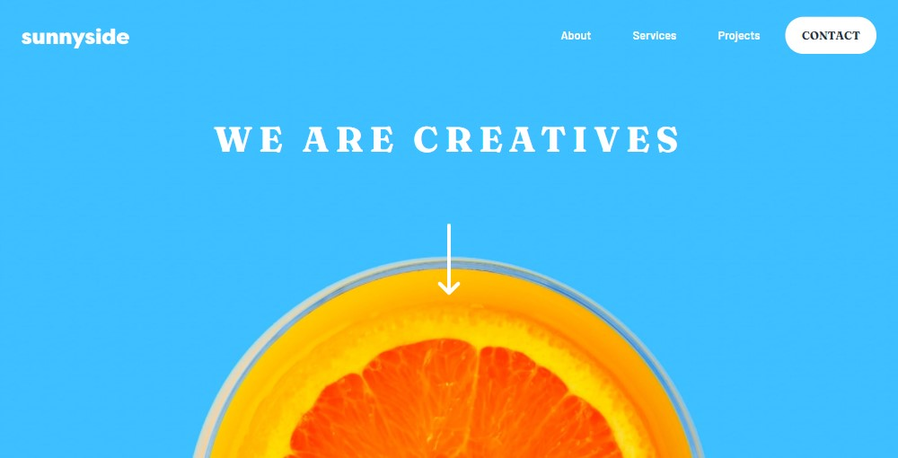

# Frontend Mentor - Sunnyside agency landing page solution

This is a solution to the [Sunnyside agency landing page challenge on Frontend Mentor](https://www.frontendmentor.io/challenges/sunnyside-agency-landing-page-7yVs3B6ef). Frontend Mentor challenges help you improve your coding skills by building realistic projects.

## Table of contents

- [Overview](#overview)
  - [The challenge](#the-challenge)
  - [Screenshot](#screenshot)
  - [Links](#links)
- [My process](#my-process)
  - [Built with](#built-with)
  - [What I learned](#what-i-learned)
  - [Continued development](#continued-development)
  - 
- [Author](#author)


## Overview

### The challenge

Users should be able to:

- View the optimal layout for the site depending on their device's screen size
- See hover states for all interactive elements on the page

### Screenshot




### Links

- Solution URL: [Add solution URL here](https://your-solution-url.com)
- Live Site URL: [Add live site URL here](https://your-live-site-url.com)

## My process

### Built with

- Semantic HTML5 markup
- Flexbox
- BEM
- JavaScript
- SCSS


### What I learned

- Flexbox
- BEM
- pseudo-elements
- SCSS
- SVG icons


<h1>Some CSS code I'm proud of</h1>
```

```css
 .article__link:hover::after {
    content: "";
    display: block;
    position: absolute;
    top: 10px;
    left: -5px;
    border-top: 8px solid rgba(250, 212, 0, 0.2);
    width: 90px;
    border-radius: 3px;
    margin-bottom: 160px; 
    }

     svg.social-icon:hover{
      fill: #fff;
    }

    .nav__menu--aktive:before {
    content: "";
    display: block;
    position: absolute;
    top: -20px;
    right: 0%;
    width: 0;
    height: 0;
    border-bottom: 20px solid white;
    border-left: 20px solid transparent; 
    }
```
<h1>Some JS code I'm proud of</h1>
```js

let menu = document.querySelector(".nav__menu");

let burger = document.querySelector(".hamburger");

burger.addEventListener("click", toggleMenu);

function toggleMenu(){

	window.setTimeout(function() {

	menu.classList.toggle("nav__menu--aktive");
	
}, 200);


}
```

### Continued development

I want to continue focusing on: JS, CSS Flex, Grid, mobile first approach and BEM in future projects. These are concepts i am still not completely comfortable with or techniques i found useful that i want to refine and perfect.


## Author

- Linkedin - [Ramil Novruzov](https://www.linkedin.com/in/ramilnovruzov/)
- Frontend Mentor - [@ramikoff](https://www.frontendmentor.io/profile/ramikoff)
